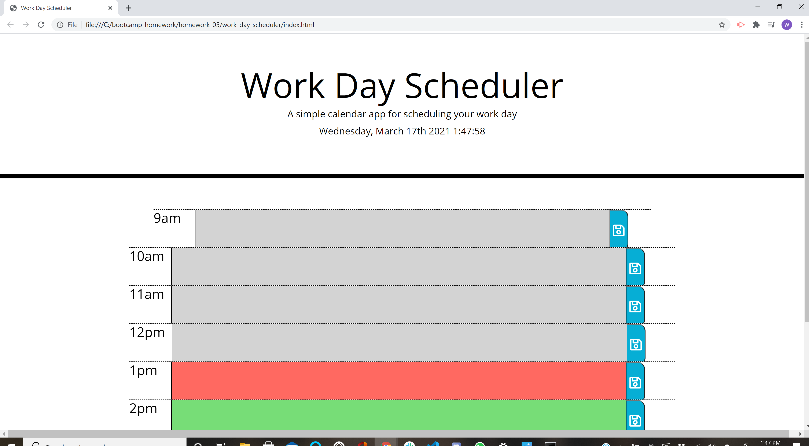

# work_day_scheduler
* as requested I put together a work plainer
* it runs from 9am to 5pm it saves text for events
* it includes the curent date and time for referance 

## overview
* the task is chalanging with the javaScript 
* the html with bootstrap was fun to work with after I installed live server
* I got help with the jQuery with my tutor for adding css class to the JS 
* I found help with the color changing in the text fields for past, present, and future in stackOverFlow 
[stackOverFlow](https://stackoverflow.com/questions/19004950/how-to-compare-time-in-javascript)

### links

* [sitelink](https://wan2748.github.io/work_day_scheduler/.)

#### Screen shots

